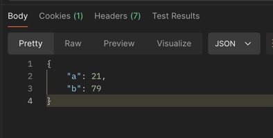
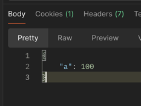
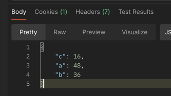

# A/B Test Service -  ABtest service, which randomly chooses items for a user according to conditions

## Background

We would like to provide the ability to test different flows and advertisements to our users using A/B test method where users will get different ads based on some parameters, after that,
we can take the results to our data team to have them analyzed.

For example, some users will get ads with a blue button and some with an orange button
and we could then compare the results and see what color was more engaging.
For that, we choose our top developer to build an AB test service that will get the user’s
parameters and will return to the user the relevant test (A, B, C, D, etc.)

## Overview

The A/B Test Service is a Node.js application designed to facilitate A/B testing for different variations of content or features based on user-defined conditions. It allows developers to configure multiple tests with varying percentages of users allocated to different test groups. This service is useful for experimenting which variation performs better based on defined metrics.

## Features

- **Dynamic Configuration**: Tests are configured via `config.json`, where each test defines conditions based on user properties (e.g., age, name, favorite animal) and specifies groups with different percentages.

- **Persistent User Assignment**: Users are consistently assigned to the same test group based on their properties, ensuring reliable test results.

- **Scalable and Dockerized**: The service is containerized using Docker for easy deployment and scalability.


### Prerequisites

- Node.js (version >= 16)
- npm (or yarn)
- Docker (if running with Docker)

### Installation

1. Clone the repository
2. Install dependencies using ```npm i```:
### Running Locally

To run the A/B Test Service locally:

```bash
npm start
```

The service will start on `http://localhost:8080`.

### Running with Docker

To run the A/B Test Service using Docker, just run:

   ```bash
   docker compose up
   ```

The service will be accessible at `http://localhost:8080`.

## API Endpoint

### `/getTest` Endpoint

- **Method**: `POST`
- **Path**: `/getTest`
- **Request Payload**: JSON object containing user properties (e.g., `age`, `name`, `favorite_animal`).
- **Response**: Returns the assigned test variant based on the user's properties.

### `/getMetrics` Endpoint

- **Method**: `GET`
- **Path**: `/getMetrics`
- **Response**: Get analytics about tests history. How many users got to which test/group.


## Configuration (config.json)

The `config.json` file defines the A/B tests and their configurations. Each test specifies conditions based on user properties and defines groups with percentages indicating the allocation of users.

Example `config.json`:

```json
{
  "tests": [
    {
      "conditions": {
        "age": { "op": ">", "value": 10 },
        "name": { "op": "=", "value": "moshe" },
        "favorite_animal": { "op": "!=", "value": "dog" }
      },
      "groups": {
        "a": { "results": "im result a1", "percentage": 30 },
        "b": { "results": "im result b1", "percentage": 70 }
      }
    },
    {
      "conditions": {
        "age": { "op": "=", "value": 10 },
        "name": { "op": "=", "value": "Israel" },
        "favorite_animal": { "op": "=", "value": "parrot" }
      },
      "groups": {
        "a": { "results": "im result a2", "percentage": 50 },
        "b": { "results": "im result b2", "percentage": 50 }
      }
    }
  ]
}
```

## POC (scipts attached on POC_TestScripts file)

### Test 1 -100 calls 80%/20%


### Test 2 - 100 calls for same user 50%/50%


### Test 3 - 100_calls_50_40_10



## Testing

To test the service, run `npm test`. This will execute the test suite using Jest and Supertest.
